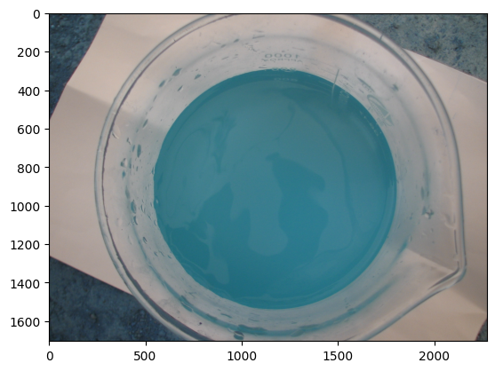
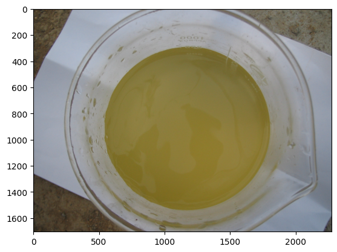
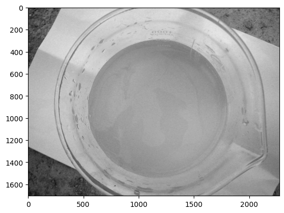
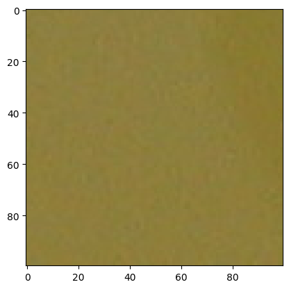

```python
import cv2  # pip install opencv-python
```

# 以一张图片为例


```python
import matplotlib.pyplot as plt
```

## 读取一张图片


```python
img_path = 'water_images/3_12.jpg'
img = cv2.imread(img_path)  # 图片路径中不能出现中文
# 使用cv2读取进来的图片格式为BGR
```


```python
# 展示图片
plt.imshow(img)
plt.show()
```


    

    


```python
img = img[:, :, ::-1]  # 修正通道为RGB
```


```python
import matplotlib.pyplot as plt
```


```python
# 展示图片
plt.imshow(img)
plt.show()
```


    

    


```python
img.shape
```


    (1704, 2272, 3)


```python
gray_img = img[:, :, 0]
gray_img.shape
```


    (1704, 2272)


```python
# 展示图片
plt.imshow(gray_img, cmap="gray")
plt.show()
```


    

    


```python

```

## 切分图片


```python
h, w = img.shape[:2]
print(f'图片的高度：{h}, 图片的宽度{w}')
```

    图片的高度：1704, 图片的宽度2272
    


```python
center_h, center_w = h // 2, w // 2
center_img = img[center_h - 50: center_h + 50, center_w - 50: center_w + 50, :]
```


```python
plt.imshow(center_img)
plt.show()
```


    

    


## 计算颜色矩


```python
# 将图片按照通道数进行切分
img_r = center_img[:, :, 0]
img_g = center_img[:, :, 1]
img_b = center_img[:, :, 2]
```


```python
# 计算一阶颜色矩
img_r1 = img_r.mean()
img_g1 = img_g.mean()
img_b1 = img_b.mean()
```


```python
# 计算二阶颜色矩
img_r2 = img_r.std()
img_g2 = img_g.std()
img_b2 = img_b.std()
```


```python
imgr3 = np.mean((img_r - img_r1) ** 3) ** (1/3)
```

    C:\Users\ming\AppData\Local\Temp\ipykernel_26728\2058995500.py:1: RuntimeWarning: invalid value encountered in scalar power
      imgr3 = np.mean((img_r - img_r1) ** 3) ** (1/3)
    


```python
imgr3
```


    nan


```python
np.sign(-1) * np.abs(-1) ** (1/3)
```


    -1.0


```python
def get_3(pix):
    E = pix.mean()
    a = np.mean((pix - E) ** 3)
    return np.sign(a) * np.abs(a) ** (1/3)
```


```python
# 计算三阶颜色矩
img_r3 = get_3(img_r)
img_g3 = get_3(img_g)
img_b3 = get_3(img_b)
```

## 提取标签


```python
img_path
```


    'water_images/3_12.jpg'


```python
label = int(img_path.split('/')[-1][0])
print(label)
```

    3
    

# 循环操作所有图片

## 获取所有图片路径


```python
from glob import glob
```


```python
all_img_path = glob('water_images/*.jpg')
```


```python
len(all_img_path)
```


    197


```python
all_img_path
```


    ['water_images\\1_1.jpg',
     'water_images\\1_10.jpg',
     'water_images\\1_11.jpg',
     'water_images\\1_12.jpg',
     'water_images\\1_13.jpg',
     'water_images\\1_14.jpg',
     'water_images\\1_15.jpg',
     'water_images\\1_16.jpg',
     'water_images\\1_17.jpg',
     'water_images\\1_18.jpg',
     'water_images\\1_19.jpg',
     'water_images\\1_2.jpg',
     'water_images\\1_20.jpg',
     'water_images\\1_21.jpg',
     'water_images\\1_22.jpg',
     'water_images\\1_23.jpg',
     'water_images\\1_24.jpg',
     'water_images\\1_25.jpg',
     'water_images\\1_26.jpg',
     'water_images\\1_27.jpg',
     'water_images\\1_28.jpg',
     'water_images\\1_29.jpg',
     'water_images\\1_3.jpg',
     'water_images\\1_30.jpg',
     'water_images\\1_31.jpg',
     'water_images\\1_32.jpg',
     'water_images\\1_33.jpg',
     'water_images\\1_34.jpg',
     'water_images\\1_35.jpg',
     'water_images\\1_36.jpg',
     'water_images\\1_37.jpg',
     'water_images\\1_38.jpg',
     'water_images\\1_39.jpg',
     'water_images\\1_4.jpg',
     'water_images\\1_40.jpg',
     'water_images\\1_41.jpg',
     'water_images\\1_42.jpg',
     'water_images\\1_43.jpg',
     'water_images\\1_44.jpg',
     'water_images\\1_45.jpg',
     'water_images\\1_46.jpg',
     'water_images\\1_47.jpg',
     'water_images\\1_48.jpg',
     'water_images\\1_49.jpg',
     'water_images\\1_5.jpg',
     'water_images\\1_50.jpg',
     'water_images\\1_51.jpg',
     'water_images\\1_6.jpg',
     'water_images\\1_7.jpg',
     'water_images\\1_8.jpg',
     'water_images\\1_9.jpg',
     'water_images\\2_1.jpg',
     'water_images\\2_10.jpg',
     'water_images\\2_11.jpg',
     'water_images\\2_12.jpg',
     'water_images\\2_13.jpg',
     'water_images\\2_14.jpg',
     'water_images\\2_15.jpg',
     'water_images\\2_16.jpg',
     'water_images\\2_17.jpg',
     'water_images\\2_18.jpg',
     'water_images\\2_19.jpg',
     'water_images\\2_2.jpg',
     'water_images\\2_20.jpg',
     'water_images\\2_21.jpg',
     'water_images\\2_22.jpg',
     'water_images\\2_23.jpg',
     'water_images\\2_24.jpg',
     'water_images\\2_25.jpg',
     'water_images\\2_26.jpg',
     'water_images\\2_27.jpg',
     'water_images\\2_28.jpg',
     'water_images\\2_29.jpg',
     'water_images\\2_3.jpg',
     'water_images\\2_30.jpg',
     'water_images\\2_31.jpg',
     'water_images\\2_32.jpg',
     'water_images\\2_33.jpg',
     'water_images\\2_34.jpg',
     'water_images\\2_35.jpg',
     'water_images\\2_36.jpg',
     'water_images\\2_37.jpg',
     'water_images\\2_38.jpg',
     'water_images\\2_39.jpg',
     'water_images\\2_4.jpg',
     'water_images\\2_40.jpg',
     'water_images\\2_41.jpg',
     'water_images\\2_42.jpg',
     'water_images\\2_43.jpg',
     'water_images\\2_44.jpg',
     'water_images\\2_5.jpg',
     'water_images\\2_6.jpg',
     'water_images\\2_7.jpg',
     'water_images\\2_8.jpg',
     'water_images\\2_9.jpg',
     'water_images\\3_1.jpg',
     'water_images\\3_10.jpg',
     'water_images\\3_11.jpg',
     'water_images\\3_12.jpg',
     'water_images\\3_13.jpg',
     'water_images\\3_14.jpg',
     'water_images\\3_15.jpg',
     'water_images\\3_16.jpg',
     'water_images\\3_17.jpg',
     'water_images\\3_18.jpg',
     'water_images\\3_19.jpg',
     'water_images\\3_2.jpg',
     'water_images\\3_20.jpg',
     'water_images\\3_21.jpg',
     'water_images\\3_22.jpg',
     'water_images\\3_23.jpg',
     'water_images\\3_24.jpg',
     'water_images\\3_25.jpg',
     'water_images\\3_26.jpg',
     'water_images\\3_27.jpg',
     'water_images\\3_28.jpg',
     'water_images\\3_29.jpg',
     'water_images\\3_3.jpg',
     'water_images\\3_30.jpg',
     'water_images\\3_31.jpg',
     'water_images\\3_32.jpg',
     'water_images\\3_33.jpg',
     'water_images\\3_34.jpg',
     'water_images\\3_35.jpg',
     'water_images\\3_36.jpg',
     'water_images\\3_37.jpg',
     'water_images\\3_38.jpg',
     'water_images\\3_39.jpg',
     'water_images\\3_4.jpg',
     'water_images\\3_40.jpg',
     'water_images\\3_41.jpg',
     'water_images\\3_42.jpg',
     'water_images\\3_43.jpg',
     'water_images\\3_44.jpg',
     'water_images\\3_45.jpg',
     'water_images\\3_46.jpg',
     'water_images\\3_47.jpg',
     'water_images\\3_48.jpg',
     'water_images\\3_49.jpg',
     'water_images\\3_5.jpg',
     'water_images\\3_50.jpg',
     'water_images\\3_51.jpg',
     'water_images\\3_52.jpg',
     'water_images\\3_53.jpg',
     'water_images\\3_54.jpg',
     'water_images\\3_55.jpg',
     'water_images\\3_56.jpg',
     'water_images\\3_57.jpg',
     'water_images\\3_58.jpg',
     'water_images\\3_59.jpg',
     'water_images\\3_6.jpg',
     'water_images\\3_60.jpg',
     'water_images\\3_61.jpg',
     'water_images\\3_62.jpg',
     'water_images\\3_63.jpg',
     'water_images\\3_64.jpg',
     'water_images\\3_65.jpg',
     'water_images\\3_66.jpg',
     'water_images\\3_67.jpg',
     'water_images\\3_68.jpg',
     'water_images\\3_69.jpg',
     'water_images\\3_7.jpg',
     'water_images\\3_70.jpg',
     'water_images\\3_71.jpg',
     'water_images\\3_72.jpg',
     'water_images\\3_73.jpg',
     'water_images\\3_74.jpg',
     'water_images\\3_75.jpg',
     'water_images\\3_76.jpg',
     'water_images\\3_77.jpg',
     'water_images\\3_78.jpg',
     'water_images\\3_8.jpg',
     'water_images\\3_9.jpg',
     'water_images\\4_1.jpg',
     'water_images\\4_10.jpg',
     'water_images\\4_11.jpg',
     'water_images\\4_12.jpg',
     'water_images\\4_13.jpg',
     'water_images\\4_14.jpg',
     'water_images\\4_15.jpg',
     'water_images\\4_16.jpg',
     'water_images\\4_17.jpg',
     'water_images\\4_18.jpg',
     'water_images\\4_19.jpg',
     'water_images\\4_2.jpg',
     'water_images\\4_20.jpg',
     'water_images\\4_21.jpg',
     'water_images\\4_22.jpg',
     'water_images\\4_23.jpg',
     'water_images\\4_24.jpg',
     'water_images\\4_3.jpg',
     'water_images\\4_4.jpg',
     'water_images\\4_5.jpg',
     'water_images\\4_6.jpg',
     'water_images\\4_7.jpg',
     'water_images\\4_8.jpg',
     'water_images\\4_9.jpg']


## 循环计算


```python
features = np.zeros((len(all_img_path), 9))
labels = []
for i in range(len(all_img_path)):
    img_path = all_img_path[i]
    # 图片读取
    img = cv2.imread(img_path)
    img = img[:, :, ::-1]  # 修正通道为RGB
    
    # 切分图片
    h, w = img.shape[:2]
    center_h, center_w = h // 2, w // 2
    center_img = img[center_h - 50: center_h + 50, center_w - 50: center_w + 50, :]
    
    # 计算颜色矩
    # 将图片按照通道数进行切分
    img_r = center_img[:, :, 0]
    img_g = center_img[:, :, 1]
    img_b = center_img[:, :, 2]
    # 计算一阶颜色矩
    features[i, 0] = img_r.mean()
    features[i, 1] = img_g.mean()
    features[i, 2] = img_b.mean()
    # 计算二阶颜色矩
    features[i, 3] = img_r.std()
    features[i, 4] = img_g.std()
    features[i, 5] = img_b.std()
    # 计算三阶颜色矩
    features[i, 6] = get_3(img_r)
    features[i, 7] = get_3(img_g)
    features[i, 8] = get_3(img_b)
    
    # 提取标签
    label = int(img_path.split('\\')[-1][0])
    labels.append(label)
```

# 特征工程

## 数据集切分


```python
from sklearn.model_selection import train_test_split
```


```python
x_train, x_test, y_train, y_test = train_test_split(features, labels, test_size=0.1)
```


```python
print(x_train.shape)
print(x_test.shape)
```

    (177, 9)
    (20, 9)
    

## 数据标准化

$$
最大最小值标准化=\frac{X-\min({X})}{\max({X})-\min({X})}
$$


```python
from sklearn.preprocessing import MinMaxScaler
```


```python
train_scaler = MinMaxScaler()
```


```python
x_train = train_scaler.fit_transform(x_train)
```


```python
x_test = train_scaler.transform(x_test)
```

# 模型的搭建及训练

## 决策树模型


```python
from sklearn.tree import DecisionTreeClassifier
```


```python
# 模型的实例化
tree_model = DecisionTreeClassifier()
# 模型训练
tree_model.fit(x_train, y_train)
# 模型验证
tree_model.score(x_test, y_test)
```


    0.65


## 随机森林模型


```python
from sklearn.ensemble import RandomForestClassifier

random_forest_model = RandomForestClassifier()
random_forest_model.fit(x_train, y_train)
random_forest_model.score(x_test, y_test)
```


    0.8


## 支持向量机模型


```python
from sklearn.svm import SVC

svm_model = SVC()
svm_model.fit(x_train, y_train)
svm_model.score(x_test, y_test)
```


    0.8


## 多层感知机


```python
from sklearn.neural_network import MLPClassifier
```


```python
mlp_model = MLPClassifier()
mlp_model.fit(x_train, y_train)
mlp_model.score(x_test, y_test)
```

    D:\ProgramSoftware\Python\Miniconda3\envs\pytorch\lib\site-packages\sklearn\neural_network\_multilayer_perceptron.py:691: ConvergenceWarning: Stochastic Optimizer: Maximum iterations (200) reached and the optimization hasn't converged yet.
      warnings.warn(
    


    0.7


# 模型存储


```python
import pickle
from sklearn.ensemble import RandomForestClassifier

with open("model.pkl", "wb") as f:
    pickle.dump(random_forest_model, f)
    
with open("train_scaler.pkl", "wb") as f:
    pickle.dump(train_scaler, f)
```

# 模型推理


```python
import pickle
import numpy as np
import cv2

with open("model.pkl", "rb") as f:
    model = pickle.load(f)
    
with open("train_scaler.pkl", "rb") as f:
    train_scaler = pickle.load(f)
    
def get_3(pix):
    E = pix.mean()
    a = np.mean((pix - E) ** 3)
    return np.sign(a) * np.abs(a) ** (1/3)
```


```python
img_path = 'water_images/3_15.jpg'
# 图片读取
img = cv2.imread(img_path)
img = img[:, :, ::-1]  # 修正通道为RGB

feature = np.zeros([1, 9])

# 切分图片
h, w = img.shape[:2]
center_h, center_w = h // 2, w // 2
center_img = img[center_h - 50: center_h + 50, center_w - 50: center_w + 50, :]

# 计算颜色矩
# 将图片按照通道数进行切分
img_r = center_img[:, :, 0]
img_g = center_img[:, :, 1]
img_b = center_img[:, :, 2]
# 计算一阶颜色矩
feature[0, 0] = img_r.mean()
feature[0, 1] = img_g.mean()
feature[0, 2] = img_b.mean()
# 计算二阶颜色矩
feature[0, 3] = img_r.std()
feature[0, 4] = img_g.std()
feature[0, 5] = img_b.std()
# 计算三阶颜色矩
feature[0, 6] = get_3(img_r)
feature[0, 7] = get_3(img_g)
feature[0, 8] = get_3(img_b)

feature = train_scaler.transform(feature)

model.predict(feature)
```


    array([3])


